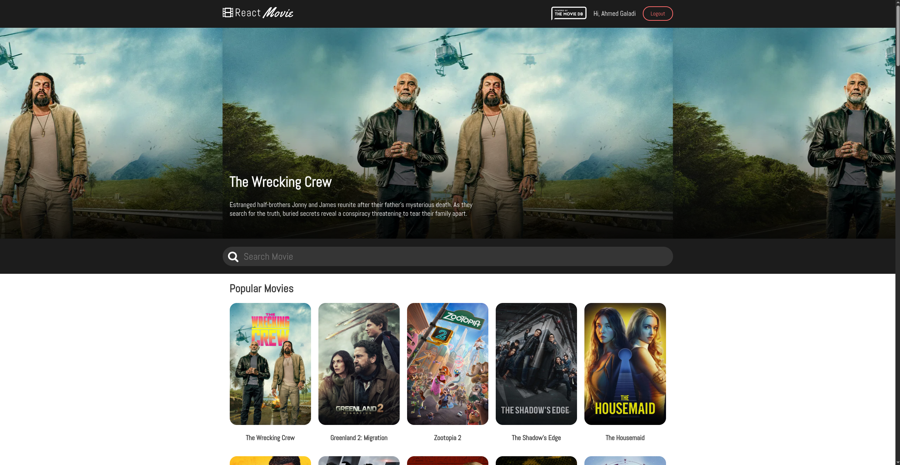

# 🎬 RMDB - React Movie Database

A full-stack movie database application built with React and Node.js, powered by The Movie Database (TMDB) API.



## ✨ Features

- **🔐 User Authentication**
  - Email/Password registration and login
  - Google OAuth integration (Sign in with Google button)
  - JWT-based session management with access & refresh tokens
  - Password reset via email (forgot password flow)
  - Protected routes for authenticated users
  - Auto-redirect: logged-in users can't access login/signup pages

- **🎥 Movie Discovery**
  - Browse popular movies
  - Search movies by title
  - Infinite scroll pagination
  - View detailed movie information
  - See cast and crew details
  - Movie ratings and runtime

- **📱 Responsive Design**
  - Mobile-friendly interface
  - Modern UI with styled-components
  - Custom styled Google Sign-In button

## 🏗️ Tech Stack

### Frontend
- **React** - UI framework
- **React Router** - Client-side routing
- **Styled Components** - CSS-in-JS styling
- **TMDB API** - Movie data

### Backend
- **Node.js + Express** - Server framework
- **Prisma** - Database ORM
- **PostgreSQL** - Database
- **JWT** - Authentication tokens
- **Google Auth Library** - OAuth integration

### DevOps
- **Docker** - Containerization
- **Docker Compose** - Multi-container orchestration
- **Nginx** - Frontend web server

## 🚀 Quick Start

### Prerequisites
- Docker and Docker Compose installed
- TMDB API key ([get one here](https://www.themoviedb.org/settings/api))
- Google OAuth credentials (optional, for Google sign-in)

### 1. Clone the repository
```bash
git clone <your-repo-url>
cd reactMovieApp
```

### 2. Configure environment
Create a `.env` file in the project root with these variables:

```env
# TMDB API
REACT_APP_API_KEY=your_tmdb_api_key

# Google OAuth
GOOGLE_CLIENT_ID=your_google_client_id
REACT_APP_GOOGLE_CLIENT_ID=your_google_client_id

# Database
POSTGRES_USER=rmdb_user
POSTGRES_PASSWORD=your_secure_password
POSTGRES_DB=rmdb_database

# JWT Secrets (change these!)
JWT_SECRET=your-super-secret-jwt-key
JWT_REFRESH_SECRET=your-super-secret-refresh-key

# Email (for password reset)
EMAIL_HOST=smtp.gmail.com
EMAIL_PORT=587
EMAIL_USER=your-email@gmail.com
EMAIL_PASSWORD=your-app-password
```

> **Note:** For Gmail, use an [App Password](https://support.google.com/accounts/answer/185833) instead of your regular password.

### 3. Start the application
```bash
make prod
```

Or for development with live logs:
```bash
make dev
```

### 4. Access the app
- **Frontend:** http://localhost:3000
- **Backend API:** http://localhost:3001
- **Health Check:** http://localhost:3001/health

## 📋 Available Commands

| Command | Description |
|---------|-------------|
| `make help` | Show all available commands |
| `make build` | Build all Docker images |
| `make up` | Start all services |
| `make down` | Stop all services |
| `make dev` | Start with live logs |
| `make prod` | Start in production mode |
| `make logs` | View all logs |
| `make clean` | Remove containers and volumes |
| `make migrate` | Run database migrations |
| `make status` | Check service status |

## 📁 Project Structure

```
reactMovieApp/
├── docker-compose.yml     # Container orchestration
├── Makefile               # Development commands
├── .env                   # Environment variables
├── README.md              # This file
├── frontend/
│   ├── Dockerfile         # Frontend container
│   ├── nginx.conf         # Nginx configuration
│   ├── public/            # Static assets
│   └── src/
│       ├── components/
│       │   ├── Landing/       # Public landing page
│       │   ├── Login/         # Login page with Google OAuth
│       │   ├── Signup/        # Registration page
│       │   ├── ForgotPassword/# Password reset request
│       │   ├── ResetPassword/ # Password reset form
│       │   ├── ProtectedRoute/# Auth guard component
│       │   ├── Header/        # Navigation header
│       │   ├── Home.js        # Movie grid
│       │   ├── Movie.js       # Movie details
│       │   └── ...            # Other UI components
│       ├── hooks/         # Custom hooks (useHomeFetch, useMovieFetch)
│       ├── context.js     # User auth context
│       ├── API.js         # TMDB API calls
│       └── config.js      # App configuration
└── backend/
    ├── Dockerfile         # Backend container
    ├── prisma/
    │   └── schema.prisma  # Database schema
    └── src/
        ├── controllers/   # Route handlers
        ├── middleware/    # Auth middleware
        ├── repositories/  # Database queries
        ├── routes/        # API routes
        └── services/      # Business logic (auth, email, google)
```

## 🔒 API Endpoints

### Authentication
| Method | Endpoint | Description |
|--------|----------|-------------|
| POST | `/api/auth/signup` | Register new user |
| POST | `/api/auth/login` | Login user |
| POST | `/api/auth/google` | Google OAuth login |
| POST | `/api/auth/refresh` | Refresh tokens |
| POST | `/api/auth/logout` | Logout user |
| POST | `/api/auth/forgot-password` | Request password reset |
| POST | `/api/auth/reset-password` | Reset password |

### Users
| Method | Endpoint | Description |
|--------|----------|-------------|
| GET | `/api/users/me` | Get current user |
| PUT | `/api/users/me` | Update current user |

## 🎨 Routes

| Route | Access | Description |
|-------|--------|-------------|
| `/` | Public* | Landing page |
| `/login` | Public* | Login page |
| `/signup` | Public* | Registration page |
| `/forgot-password` | Public | Request password reset |
| `/reset-password` | Public | Reset password with token |
| `/movies` | Protected | Movie list (home) |
| `/movie/:id` | Protected | Movie details |

> *Public pages automatically redirect to `/movies` if user is already logged in. Navigation uses `replace: true` to prevent back-button access to auth pages after login.

## 🔐 Authentication Flow

### Email/Password
1. User registers at `/signup` with email, password, name
2. User logs in at `/login`
3. Backend returns JWT access token (15min) + refresh token (7 days)
4. Tokens stored in localStorage
5. Protected routes check for valid token

### Google OAuth
1. User clicks "Continue with Google" button
2. Google Identity Services popup opens
3. User selects Google account
4. Google returns ID token
5. Backend verifies token with Google
6. Backend creates/finds user, returns JWT tokens

### Password Reset
1. User clicks "Forgot password?" on login page
2. Enters email at `/forgot-password`
3. Backend sends reset link via email
4. User clicks link, goes to `/reset-password?token=xxx`
5. User enters new password
6. Backend verifies token and updates password


## 🙏 Credits

- Movie data provided by [The Movie Database (TMDB)](https://www.themoviedb.org/)
- Icons and design inspiration from various open-source projects
